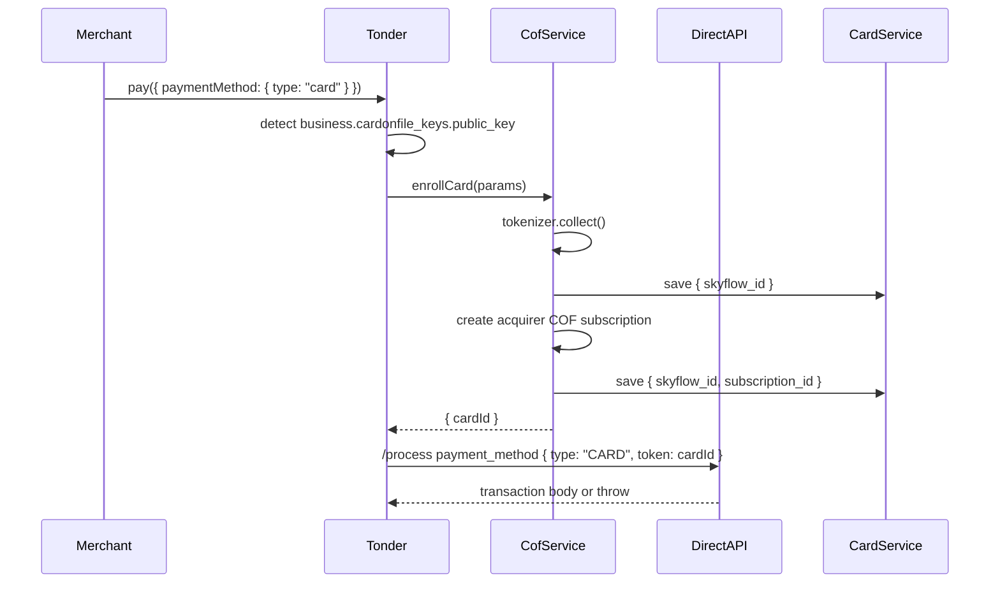

# Design: COF payment flow

## Context

`Tonder.pay()` currently resolves `paymentMethod.type === 'card'` by calling `tokenizer.collect()` in `/Volumes/MacDev/Tonder/SDKs/tonder-js/src/tonder.ts` and sending raw field-token refs through `buildCardPaymentMethod()` from `/Volumes/MacDev/Tonder/SDKs/tonder-js/src/core/strategies/card.strategy.ts`. Standalone COF enrollment already exists in `/Volumes/MacDev/Tonder/SDKs/tonder-js/src/core/services/cof.service.ts` and rolls back partial enrollment failures through `/Volumes/MacDev/Tonder/SDKs/tonder-js/src/core/services/card.service.ts`.

The design keeps the public API unchanged and composes existing services from the facade. `core/` remains pure: no DOM, adapter, or facade state leaks into core services.

## Decision

Add a COF-active new-card branch in `/Volumes/MacDev/Tonder/SDKs/tonder-js/src/tonder.ts`, before the existing raw-card collection branch:

1. If `input.paymentMethod.type !== 'card'`, keep the existing paths unchanged.
2. If `type === 'card'` and `state.business?.cardonfile_keys?.public_key` is absent, keep existing raw-card behavior: one `tokenizer.collect()` then `buildCardPaymentMethod(tokens)`.
3. If `type === 'card'` and COF is active, call `resolveCardAuth()` and `cofService.enrollCard(params)`. That method performs the single collect for this flow. Then call `/process/` with `buildSavedCardPaymentMethod(cardId)`.

This avoids double `tokenizer.collect()` by making payment-method resolution mutually exclusive: COF path enrolls and returns token-only saved-card method; non-COF path collects raw card tokens.

## Flow

## Implementation shape

- `/Volumes/MacDev/Tonder/SDKs/tonder-js/src/tonder.ts`
  - Add a private helper such as `isCofActive(): boolean` based only on `this.core.getState().business?.cardonfile_keys?.public_key`.
  - Add a private helper such as `buildCofEnrollParams(currency?: string)` that calls `resolveCardAuth()` and maps cached/registered customer input into `EnrollParams`.
  - Change `resolvePaymentMethod` to accept the `PayInput` or currency, so the COF path can pass payment currency to `CofService.enrollCard(params)`.
  - On COF-active card pay, return `{ paymentMethod: buildSavedCardPaymentMethod(cardId), enrolledCardId: cardId }` or equivalent local metadata so `pay()` can rollback only process throws.
  - In `pay()`, wrap only the `/process/` call with the new rollback boundary. If `/process/` throws after enrollment and before a raw transaction body exists, call `cardService.removeCard(businessPk, enrolledCardId, secureToken, userToken)` best-effort, then rethrow the original error.

Do not add `enable_card_on_file` or `subscription_id` to `ProcessPaymentBody`; `/Volumes/MacDev/Tonder/SDKs/tonder-js/src/core/services/direct-api.service.ts` already supports saved-card token payment.

## Rollback boundaries

Reuse `CofService.enrollCard()` rollback for enrollment failures. Add only this facade-level rollback: enrollment succeeded, `/process/` throws. Swallow DELETE errors and surface the original process error. Do not remove the card when `/process/` returns any transaction body, including `Declined`, `Pending`/3DS, or success. Do not remove on `handleRequiresAction()`, polling, redirect, embedded modal, or messenger failures because a transaction already exists.

## Tests

Extend `/Volumes/MacDev/Tonder/SDKs/tonder-js/src/tonder.pay.test.ts` with Vitest-first coverage:

- COF-active new-card `pay()` performs enrollment before `/process/` and calls collect exactly once.
- `/process/` body has `payment_method: { type: 'CARD', token: 'sky_1' }` and excludes raw card fields, `enable_card_on_file`, and `subscription_id`.
- Non-COF `pay(card)` keeps existing raw-card assertions.
- `pay(savedCard)` does not collect/enroll.
- Process transport throw after enrollment removes the just-enrolled card best-effort and rethrows original `PAYMENT_PROCESS_ERROR`.
- Declined body and pending/3DS body do not remove the card, including later embedded/polling failure.

## Risks

- Customer registration becomes part of COF-active `pay(card)` because saved-card endpoints require `User-Token`; tests must assert this intentionally.
- Rollback must be scoped around `/process/` only; broad `try/catch` around 3DS handling would delete valid cards incorrectly.
